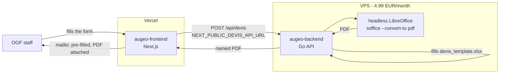

## One coordinator repo, two deploy targets

`augeo` (this repo) holds both `frontend/` and `devis-api/`. It's where every PR gets reviewed and where [CI](ci.md) runs. Nothing deploys from here directly.

On every push to `main`, the `sync-subrepos` workflow checks which of the two folders changed, and for each one runs `git subtree split` and force-pushes the result as the full history of a dedicated repo:

- `frontend/` → [augeo-frontend](https://github.com/0x11semprez/augeo-frontend), which Vercel auto-deploys
- `devis-api/` → [augeo-backend](https://github.com/0x11semprez/augeo-backend), which the VPS pulls and rebuilds

A single coordinator repo means one place to review a change and one CI gate before it can reach either deploy target, while the two subrepos stay clean, single-purpose mirrors — `augeo-frontend` is nothing but the Next.js app, so pointing Vercel at it just works, no monorepo root or build-path configuration involved.

## Why Vercel for the frontend, a VPS for the backend

The frontend is a plain Next.js form: no reason to run it anywhere other than Vercel. Free hosting, push-to-deploy, preview URLs per PR, and painless custom domain management — there's no faster way to ship or debug a Next.js app.

The backend is a different kind of workload: it shells out to `soffice` (headless LibreOffice) to convert the generated `.xlsx` into a PDF, which means an actual binary has to be installed on whatever runs it — not a fit for a serverless/edge function. It also may need to store generated documents down the line. A €4.99/month VPS runs the Go binary and LibreOffice in Docker (see [Dockerfile](../devis-api/Dockerfile)) with full control and no per-request or per-GB pricing — order of magnitude cheaper than a managed platform like Supabase or Railway once storage enters the picture.

## Wiring the two together

The frontend only knows the backend through one environment variable, `NEXT_PUBLIC_DEVIS_API_URL`, set in the Vercel dashboard. Pointing the frontend at a different backend (staging, a new VPS, a different port) is an env var change on Vercel — no code change, no redeploy of the backend.
