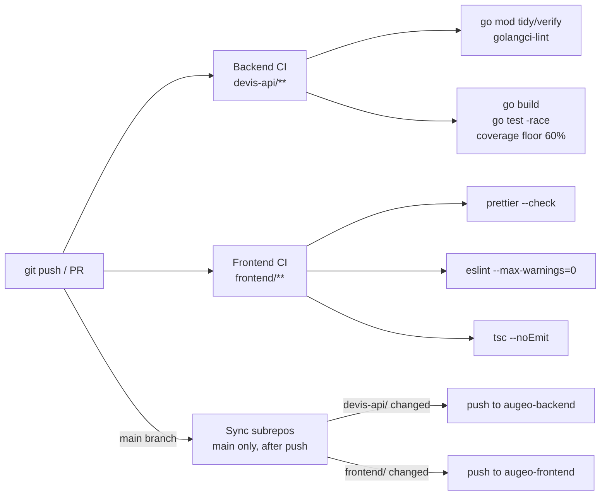

## Two independent workflows, path-filtered

[backend-ci.yml](../.github/workflows/backend-ci.yml) and [frontend-ci.yml](../.github/workflows/frontend-ci.yml) each only trigger on changes under their own folder (`paths: ["devis-api/**", ...]` / `paths: ["frontend/**", ...]`), so a frontend-only change never waits on a Go build and vice versa. Both run on every push to `main` and on every pull request; a new push to the same branch cancels whatever run is still in progress for it.

Backend CI lints (`golangci-lint`, `go mod tidy -diff`, `go mod verify`) and builds + tests on Linux and macOS, failing if coverage drops under 60%. Frontend CI checks formatting (`prettier`), lint (`eslint`, zero warnings tolerated) and types (`tsc --noEmit`). Each workflow ends in a `ci-ok` job that fails if any of its jobs failed or were cancelled — the single required status check for branch protection.

## Reaching the deploy targets

[sync-subrepos.yml](../.github/workflows/sync-subrepos.yml) runs after a push lands on `main` (not on pull requests). It detects which of `devis-api/` or `frontend/` changed, then for each one does a `git subtree split` and force-pushes the result to [augeo-backend](https://github.com/0x11semprez/augeo-backend) / [augeo-frontend](https://github.com/0x11semprez/augeo-frontend) — see [architecture.md](architecture.md) for why the repo is split this way. It authenticates with a dedicated `SYNC_REPOS_TOKEN` rather than the default `GITHUB_TOKEN`, and checks out with `persist-credentials: false` so the default token can't accidentally get used for the push instead.

Note this workflow doesn't gate on backend-ci/frontend-ci passing first — it fires directly off the push to `main`. In practice `main` is protected by the `ci-ok` checks above, so by the time a commit is on `main` it has already passed CI.
